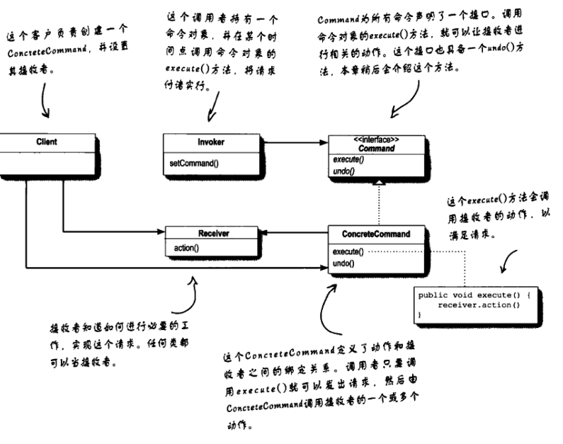
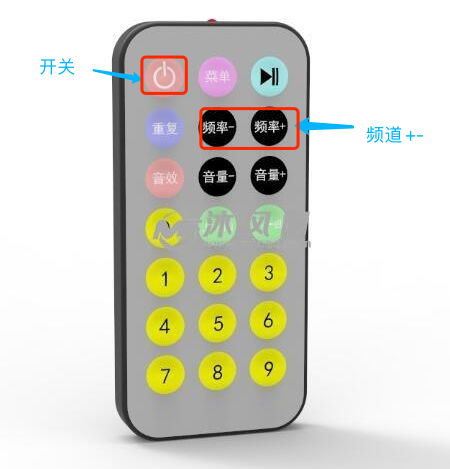

typescript实现命令模式


## 定义
命令模式将不同的请求封装成命令对象，接受者根据实际业务调用这些命令对象。

当不同的业务集中到一个方法中时，采用命令模式将每个业务作为一条命令执行，通过命令模式解除耦合。

## 类模型


- `Command`接口: 包含`excute()`, `undo()`方法
- `ConcreteCommand`类,具体命令，实现Command接口
- `Client`类: 客户,创建命令->绑定请求者
- `Receiver`类: 具体业务
- `Invoker`类: 命令请求者。只接收指令并执行，不用管具体指令是什么。包含`setCommand(command)`

## 遥控器例子
有一个遥控器，上面有很多开关按钮，每个开关控制一个电器，例如开关1控制电视电灯，开关二控制电视机开和关，开关三控制电视机频道。。。如下图



1.Receiver-业务类,电灯和电视机
```js
export class Light{
    on(){
        console.log('开灯')
    }
    off(){
        console.log('关灯')
    }
}
export class TV{
    channel: number = 0;
    on(){
        console.log('打开电视')
    }
    off(){
        console.log('关闭电视')
    }
    play(){
        this.channel = 12;
        console.log('播放体育频道')
    }
    // 频道+
    channelUp(){
        if (this.channel < 100) {
            this.channel ++;
            console.log('频道+,当前频道=',this.channel)
        }
    }
    // 频道-
    channelDown(){
        if (this.channel > 0) {
            this.channel --;
            console.log('频道-,当前频道=',this.channel)
        }
    }
}
```
2.写一个command接口
```js
export interface Command{
    // 执行
    excute: () => void;
    // 撤销
    undo?: () => void;
}
```
3. command接口实现类
```js
import {Command} from '../Command'
import {Light} from '../../receiver/Light'
// 开灯
export class LightOn implements Command{
    private receriver: Light;
    constructor(receriver: Light){
        this.receriver = receriver;
    }
    excute(){
        this.receriver.on();
    }
}
// 关灯
export class LightOff implements Command{
    private receriver: Light;
    constructor(receriver: Light){
        this.receriver = receriver;
    }
    excute(){
        this.receriver.off();
    }
}
```

```js
import {Command} from '../Command'
import {TV} from '../../receiver/TV'
// 开
export class TVOn implements Command{
    private receriver: TV;
    constructor(receriver: TV){
        this.receriver = receriver;
    }
    excute(){
        this.receriver.on();
    }
}
// 关
export class TVOff implements Command{
    private receriver: TV;
    constructor(receriver: TV){
        this.receriver = receriver;
    }
    excute(){
        this.receriver.off();
    }
}
// 播放
export class TVPlay implements Command{
    private receriver: TV;
    constructor(receriver: TV){
        this.receriver = receriver;
    }
    excute(){
        // this.receriver.on();
        this.receriver.play();
    }
}

export class ChannelUp implements Command{
    private receriver: TV;
    constructor(receriver: TV){
        this.receriver = receriver;
    }
    excute(){
        this.receriver.channelUp();
    }
    undo(){
        console.log('ChannelUp-频道撤回')
        this.receriver.channelDown()
    }
}
export class ChannelDown implements Command{
    private receriver: TV;
    constructor(receriver: TV){
        this.receriver = receriver;
    }
    excute(){
        this.receriver.channelDown();
    }
    undo(){
        console.log('ChannelDown-频道撤回')
        this.receriver.channelUp()
    }
}
```

4.请求者
```js
import {Command} from './command/Command'

export class Invoker{
    private command!: Command;
    constructor(command: Command){
        this.setCommand(command);
    }
    // 设置命令
    private setCommand(command: Command){
        this.command = command;
    }
    // 执行命令
    action(){
        this.command.excute();
    }
    undo(){
        if (this.command.undo){
            this.command.undo();
        }
    }
}
```
5.客户端-创建命令，绑定请求者
```js
import {Invoker} from './Invoker'
import * as LightCommand from './command/impl/Light';
import * as TVCommand from './command/impl/TV';
import {Light} from './receiver/Light'
import {TV} from './receiver/TV';

export class Client{
    private switch: Map<string,Invoker> = new Map();
    private tv: TV;
    private light: Light;
    private undo: string = '';
    constructor(){
        this.tv = new TV();
        this.light = new Light()
        this.lightOn();
        this.lightOff();
        this.tvOn();
        this.tvOff();
        this.tvPaly();
        this.tvChannelUp();
        this.tvChannelDown();

    }
    // 开灯
    private lightOn(){
        const command = new LightCommand.LightOn(this.light)
        const invoker = new Invoker(command)
        if (!this.switch.has('lightOn')){
            this.switch.set('lightOn', invoker);
        }
    }
    // 关灯
    private lightOff(){
        const command = new LightCommand.LightOff(this.light)
        const invoker = new Invoker(command)
        if (!this.switch.has('lightOff')){
            this.switch.set('lightOff', invoker);
        }
    }
    // 开电视
    private tvOn(){
        const command = new TVCommand.TVOn(this.tv)
        const invoker = new Invoker(command)
        if (!this.switch.has('tvOn')){
            this.switch.set('tvOn', invoker);
        }
    }
    private tvOff(){
        const receiver = new TV();
        const command = new TVCommand.TVOff(this.tv)
        const invoker = new Invoker(command)
        if (!this.switch.has('tvOff')){
            this.switch.set('tvOff', invoker);
        }
    }
    // 关电视
    private tvPaly(){
        const command = new TVCommand.TVPlay(this.tv)
        const invoker = new Invoker(command)
        if (!this.switch.has('tvPaly')){
            this.switch.set('tvPaly', invoker);
        }
    }
    // 电视频道+
    private tvChannelUp(){
        const command = new TVCommand.ChannelUp(this.tv)
        const invoker = new Invoker(command)
        if (!this.switch.has('tvChannelUp')){
            this.switch.set('tvChannelUp', invoker);
        }
    }
    // 电视频道-
    private tvChannelDown(){
        const command = new TVCommand.ChannelDown(this.tv)
        const invoker = new Invoker(command)
        if (!this.switch.has('tvChannelDown')){
            this.switch.set('tvChannelDown', invoker);
        }
    }
    
    // 执行
    public run(key: string){
        switch (key) {
            case 'tvUndo':
                this.switch.get(this.undo)?.undo();
                break;
            default:
                this.switch.get(key)?.action();
                this.undo = key;
                break;
        }
        
    }
    
}
```

测试
```js
import {Client} from './Client'

// yarn run ts-node test.ts
(() => {
    const client = new Client();

    client.run('tvOn');
    client.run('tvPaly');
    client.run('tvChannelUp');
    client.run('tvUndo');
    client.run('')
    client.run('tvChannelDown')
    client.run('tvUndo')
    client.run('tvUndo')
})()
```
输出：
```js
打开电视
播放体育频道
频道+,当前频道= 13
ChannelUp-频道撤回
频道-,当前频道= 12
频道-,当前频道= 11
ChannelDown-频道撤回
频道+,当前频道= 12
ChannelDown-频道撤回
频道+,当前频道= 13
```

参考文献：
- Head First设计模式
- [菜鸟数据-命令模式](https://www.runoob.com/design-pattern/command-pattern.html)
- [Client/Receiver/Invoker/Command之间的关系](https://www.cnblogs.com/java-my-life/archive/2012/06/01/2526972.html)
