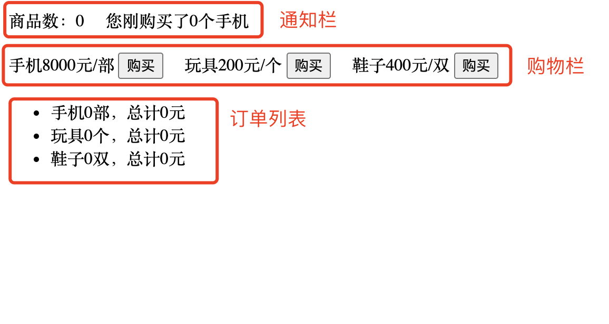

# 发布-订阅模式

- 1.什么是发布-订阅模式
- 2.举例
- 3.发布-订阅模式与观察者模式有什么区别

# 1.什么是发布-订阅模式
发布订阅模式常用于异步编程，在浏览器中，我们调用`document.body.addEventListener('click', function(){ })`就是一种这种模式的实现，这段代码是在订阅一个body上的点击事件，当用户点击`body`后，dom就会发布一个类型为`click`的消息，并且执行我们注册的回调事件，这时我们就能监听到用户点击行为了。

举一个企业招聘的例子，X公司的HR在智联在智联招聘网站上发布一条招聘前端工程师的信息，当你登陆该网站后订阅前端招聘通知，只要有企业发布起那段招聘信息，你都会收到消息。

那么，你的订阅行为就是`subscribe`,HR发布消息行为就是`publish`,网站就是一个消息中介，负责将HR发布的信息发送到每个订阅人的手机上。

我们总结一下订阅模式三要素
- 1.订阅者-subscriber
- 2.发布消息者-publisher
- 3.中介公司


# 2.举例
下面我们举一个购物网站的例子，设计一个页面，包含通知栏/购物栏/订单列表三个部分



当购买意见商品后，刷新通知栏和订单列表。

在这个例子中，触发按钮`购买`发布一条消息将商品数量添加到订单中，订阅者在收到新商品后刷新通知栏和订单列表.
### 1.创建一个发布-订阅管理器
包含三个方法
- 1.create():创建实例
- 2.publish():发布一条消息
- 3.subscribe():订阅消息
```js
/**
 * 创建订阅-发布模式实例
 * create()方法创建出的实例是单例模式，每个命名空间都有一个独立的单例对象。
 */
const PSManager = (function () {
    var namespacesCache = {}
    var listenerMap = new Map();// key为消息类型
    /**
     * 发布消息
     * @param {string} type   消息类型
     * @param  {...any} args 消息内容
     */
    var publish = function(type, ...args){
        if (listenerMap.get(type)) {
            var listeners = listenerMap.get(type);
            listeners.forEach(callback => {// 订阅池里的所有事件全部触发
                callback && callback.apply(null, args)
            });
        }
    }
    /**
     * 订阅消息
     * @param {string} type     消息类型
     * @param {*} callback      收到消息后执行回调函数
     */
    var subscribe = function(type, callback){
        if (listenerMap.get(type)) {
            var listeners = listenerMap.get(type);
            listeners.push(callback)// 添加新的订阅
        } else {
            listenerMap.set(type, [callback])
        }
    }
    /**
     * 创建一个发布-订阅模式的实例
     * @param {*} namespace     命名空间，解决多个模块调用出现冲突,不传默认'_default'
     * @returns 实例
     */
    var create = function(namespace = '_default'){
        return namespacesCache[namespace] ? namespacesCache[namespace] : {
            publish, subscribe
        }
    }
    return {
        publish, subscribe, create
    }
})()

```
### 2.页面
```html
<!DOCTYPE html>
<html>
<style>
    button { margin-right: 16px; }
    div { margin-bottom: 20px; }
</style>
<head>
    <meta charset="utf-8">
    <title>发布-订阅模式</title>
</head>
<body>
    <div>
        <span>商品数：0</span>
        <span style="margin-left: 16px;">您刚购买了0个手机</span>
    </div>
    <div>
        <span>手机8000元/部</span> <button>购买</button>
        <span>玩具200元/个</span> <button>购买</button> 
        <span>鞋子400元/双</span> <button>购买</button> 
    </div>
    <ul>
        <li>手机0部，总计0元</li>
        <li>玩具0个，总计0元</li>
        <li>鞋子0双，总计0元</li>
    </ul>
</body>
<script src="./index.js"></script>
</html>
```
### 3.业务代码
```js
// 状态管理器，存储商品数量、单价，总消费价格等信息
var State = function(){
    var state = {
        phone: [8000,0,0], toy: [200,0,0], shoes: [400,0,0]
    }
    return {
        add:function(key,count){// 添加一个商品
            state[key] === undefined ? state[key][1] = 0 : state[key][1] += count;
            return this;
        },
        getCount: function(key){// 某类商品数量
            return state[key] === undefined ? 0 : state[key][1]
        },
        getPrice: function(key){// 商品总价 = 数量 * 单价
            return state[key] === undefined ? 0 : state[key][1] * state[key][0];
        },
        sum: function(){// 总商品数
            return Object.keys(state).reduce((ret, key) => ret += state[key][1], 0);
        },
        getTip: function(key){// 提示语
            switch(key){
                case 'phone':
                    return [`手机${this.getCount(key)}部，总计${this.getPrice(key)}元`, '您刚购买了1部手机'];
                case 'toy':
                    return [`玩具${this.getCount(key)}个，总计${this.getPrice(key)}元`, '您刚购买了1个玩具']
                case 'shoes':
                    return [`鞋子${this.getCount(key)}双，总计${this.getPrice(key)}元`, '您刚购买了1双鞋子']
                default:
                    return [];
            }
        }
    }
}()
// 具体业务代码
window.onload = function () {
    var btns = document.getElementsByTagName('button')
    var spans = document.getElementsByTagName('span')
    var lies = document.getElementsByTagName('li')
    // 发布消息
    btns[0].onclick = function () {// 购买手机
        PSManager.create('order_list').publish('phone',1)
    }
    btns[1].onclick = function () {// 购买玩具
        PSManager.create('order_list').publish('toy',1)
    }
    btns[2].onclick = function () {// 购买鞋子
        PSManager.create('order_list').publish('shoes',1)
    }
    // 订阅消息
    PSManager.create('order_list').subscribe('phone',function(count){
        lies[0].innerText = State.add('phone', count).getTip('phone')[0];// 刷新通知栏
        spans[0].innerText = `总商品数：${State.sum()}`;// 刷新通知栏
        spans[1].innerText = State.getTip('phone')[1]// 刷新订单列表
    })
    PSManager.create('order_list').subscribe('toy',function(count){
        lies[1].innerText = State.add('toy', count).getTip('toy')[0];
        spans[0].innerText = `总商品数：${State.sum()}`;
        spans[1].innerText = State.getTip('toy')[1]
    })
    PSManager.create('order_list').subscribe('shoes',function(count){
        lies[2].innerText = State.add('shoes', count).getTip('shoes')[0];
        spans[0].innerText = `总商品数：${State.sum()}`;
        spans[1].innerText = State.getTip('shoes')[1]
    })
}
```

# 3.发布-订阅模式与观察者模式有什么区别
